# Evaluations

## Running times

The running times have been computed on Nvidia® Tesla V100 GPUs with 32 GB of memory and  Intel® Xeon® Gold 6230 CPUs.
The following table shows real time factors you can expect from the model.

| batch_size | GPU | CPU |
|:-----:|:-----:|:-----:|
| 32 | 1/35 | 0.27 |
| 64 | 1/45 |0.26 |
| 128 | OOM* | 0.25 |
| 256 | OOM | 0.24 |

***Tab 0. Running times as a function of the batch size and the device.***

It takes roughly 1/35 of the audio duration to run the model with a batch of size 32 on GPU.
Similarly, it takes approximately 1/4 of the audio duration to run the model on CPU.

*OOM stands for out of memory.

## Within-domain performances

As documented in [a forthcoming paper](**AC2ML PLEASE INSERT LINK to arxiv or OSF version of the paper**), the present model was trained on a corpus called BabyTrain,
containing a collection of subcorpora recorded from different infants, and sometimes using diverse equipment and in pursue of different
goals. As a result, each subcorpus can be conceived as a different domain.

Each of the subcorpora in BabyTrain had been split into three parts, thus generating a training, development, and test set with
representative data of each. After analyses were performed, we realized performance was lower when one subcorpus (containing
corpora from the [Paidologos Project](https://phonbank.talkbank.org/access/Paidologos.html)) was included.

Here are the results computed on the development set and the test set of BabyTrain (when the Paido domain has been removed).
All the results are given in terms of ***fscore*** between ***precision*** and ***recall*** such as computed in [pyannote-metrics](https://github.com/pyannote/pyannote-metrics).
The AVE. row shows average performances across classes.

| Class | Precision | Recall | Fscore |
| -----:|:-----:|:-----:|:-----:|
| KCHI | 81.75 | 79.58 | 80.65 |
| CHI | 22.15 | 49.67 | 30.63 |
| FEM | 84.14 | 84.27 | 84.21 |
| MAL | 43.38 | 44.08 | 43.73 |
| SPEECH | 89.36 | 91.32 | 90.33 |
| AVE | 64.16 | 69.79 | 65.91 | 

***Tab 1. Performances of our model on the development set.***

| Class | Precision | Recall | Fscore |
| -----:|:-----:|:-----:|:-----:|
| KCHI | 81.69 | 73.48 | 77.37 | 
| CHI | 18.78 | 40.45 | 25.65 | 
| FEM | 77.94 | 87.40 | 82.40 | 
| MAL | 37.82 | 47.86 | 42.25 | 
| SPEECH | 85.51 | 91.59 | 88.45 |
| AVE | 60.35 | 68.15 | 63.22 |

***Tab 2. Performances of our model on the test set.***

The thresholds that decide whether each class is activated or not have been computed on the development set.
If you have some annotations, you can fine-tune these thresholds on your own dataset. See instructions [here](**AC2ML PLEASE INSERT LINK**).

Depending on your goal, you might also want to optimize more the precision than the recall (or vice-versa).
With [pyannote-audio](https://github.com/MarvinLvn/pyannote-audio/tree/voice_type_classifier **AC2ML pls fix link**), you can maximize these thresholds based on the recall while fixing the precision.

By doing so, you can end up with a model that has a high precision/low recall or low precision/high recall, which might be useful for some applications.
For instance, we might have some data in which we'd like to annotate the target child's vocalizations at the grammatical level.
In that case, it'd be useful to run a model that has a high precision but low recall on the dataset. That way, we can extract moments when we are almost sure that the key-child is vocalizing, accepting that we miss some vocalizations that are too short or noisy.
Conversely, we might want to extract all the moments where the key child is vocalizing because we are looking at a population where children vocalize very little, so we need to find ALL the vocalizations, accepting we'll have some false alarms. In that case, we'd like to have a model with a low precision, but high recall.
In the absence of prior knowledge on the application, optimizing the fscore between precision and recall seemed a good strategy, and that is how the current model was done.

For illustrative purposes, here's the precision/recall (computed on the development set) curves for each of the classes: 

This graph shows precision/recall curves while varying the threshold associated to each class. 
The *AVE.* curves show the average performances of the model across classes.
For a given class, a low threshold will lead to accept (activate the class of interest) frequently: low precision & high recall.
Whereas a high threshold will lead the model to be selective, activating the class of interest only when the associated score is high: high precision & low recall.

For instance, a threshold of 0.4 on the **FEM** class leads to 85% precision and 82% recall on this class.
What we observe on the **OCH** class is that high thresholds (> 0.7) lead the model to accept a lot of irrelevant examples: that's why we obtain a low precision/low recall behaviour on the bottom left of the graph. 

 

## Performances on a held-out set 

We compute the performances on a held-out set, a set that has never been seen during the training. For comparability to previous work, we use a set that was employed in a recent paper evaluating a closed source, proprietary algorithm called LENA. This paper is available [here](https://osf.io/mxr8s). The data, however, are not publicly available, so people interested in those data should reach out to members of the [ACLEW Project](https://sites.google.com/view/aclewdid/home) to ask for access.

Since the LENA algorithm has previously benchmarked, here, we'd like to compare our model to LENA's, but the two models  have a slightly different design. The main differences between the LENA model and ours are:
1) Our model returns a **SPEECH** class whereas LENA does not.
2) LENA returns an **OVL** class (without specifying which classes are overlapping, and even considering overlap between speech and non-speech classes) whereas our model does not have an **OVL** class, but multiple classes can be activated at the same time.
3) LENA returns a class for electronic noises (**ELE** e.g. from TV) whereas our model does not (our training set hasn't been annotated for this class).
4) LENA returns other classes (such as non-speech & non-TV noise) that our model does not, and which are not annotated in the dataset.

Comparing these two models requires us to make some choices: 

1) We need to map the set of labels provided by LENA to a new set
containing only the labels **KCHI**, **CHI**, **MAL**, **FEM**, and **SPEECH** that our model also has, and that can be derived from the human annotations of the held-out set. We have chosen a mapping that is conceptually sound and that leads to the best performances for LENA: CHN=KCHI, CXN=CHI, MAN=MAL, FAN=FEM; all four of those to **SPEECH**; all other classes to **SIL**.

2) What to do with the **OVL** class ? 
This class is not explicitly present in our set of human-annotated labels. 
However, and since a given frame might have been annotated as belonging to 2 classes by humans, we can choose to map the frames with more than 2 speakers to the **OVL** class.
By doing so, we would lose the information of which types of voices are overlapping.
Another option might consist of not creating the **OVL** class, keeping human-made labels untouched. 
In this case, a model would have to predict multiple classes at the same time, the same way humans did, which our model does but not LENA's.

3) What to do with the **ELE** class ?
One choice could be to completely discard this class as our model doesn't predict electronic speech.
Or, and since our held-out set has been annotated for this class, we coud have a look at the distribution of predictions
for electronic speech to see if electronic speech is classified as speech by our model.

In ***Tab 3.*** (our model) and ***Tab 4.***  (LENA's) we do not create an **OVL** class, but instead overlapping speakers are separately considered in the evaluation.
If a given frame has been annotated as belonging to both **KCHI** and **FEM**, the model is also going to be expected to return these 2 classes.
In other words, all the classes are evaluated separately as binary classification problems: **KCHI** vs **non-KCHI**, **KCHI** including key-child vocalizations overlapping with anything else.
We are aware that this choice potentially advantages our model over LENA. 
But we think that by doing so, we penalize LENA's design that is less informative than our model in case of overlapping speech.
Similarly, we map electronic speech to silence, which may seem to disadvantage LENA (although LENA's performance is lower when the opposite analytic path is taken).
For fairness, we explore alternative choices in the section showing the confusion matrices. 

| Class | Precision | Recall | Fscore |
| -----:|:-----:|:-----:|:-----:|
| KCHI | 62.37 | 76.67 | 68.78 |
| CHI | 46.77 | 25.78 | 33.24 |
| FEM | 70.30 | 57.87 | 63.48 |
| MAL | 39.52 | 46.92 | 42.91 |
| SPEECH | 77.03 | 79.89 | 78.43 |
| AVE | 59.20 | 57.42 | 57.37 |

***Tab 3. Performances of our model on the held-out set.***

| Class | Precision | Recall | Fscore |
| -----:|:-----:|:-----:|:-----:|
| KCHI | 60.91 | 50.07 | 54.96 |
| CHI |27.34 | 29.97 | 28.59 |
| FEM | 63.87 | 31.96 | 42.60 |
| MAL | 43.57 | 32.5 | 37.23 |
| SPEECH | 65.04 | 76.35 | 70.24 |
| AVE | 52.15 | 44.17 | 46.73 |

***Tab 4. Best performances of the LENA model on the held-out set. For more information on  LENA performances, refer to [[1]](https://www.researchgate.net/publication/334855802_A_thorough_evaluation_of_the_Language_Environment_Analysis_LENATM_system).***

## Confusion matrices

To better understand which kind of errors our model and LENA's model are doing, we can have a look
at the confusion matrices.

### Speech / Non Speech

_Choices:_ 
- **SPEECH** built from the union of [**KCHI**, **OCH**, **MAL**, **FEM**] for both LENA and gold labels
- **SPEECH** considered "as is" for our model

Precision of LENA            |  Recall of LENA
:-------------------------:|:-------------------------:
 | 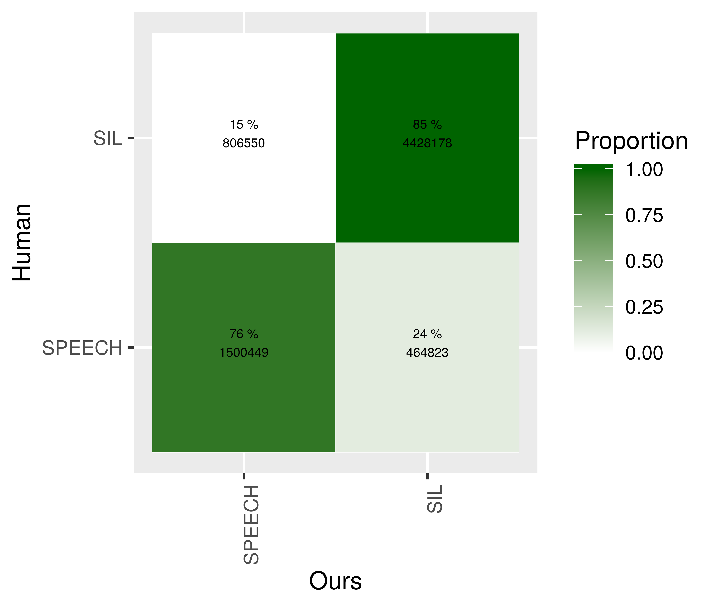

Precision of our model            |  Recall of our model
:-------------------------:|:-------------------------:
 | 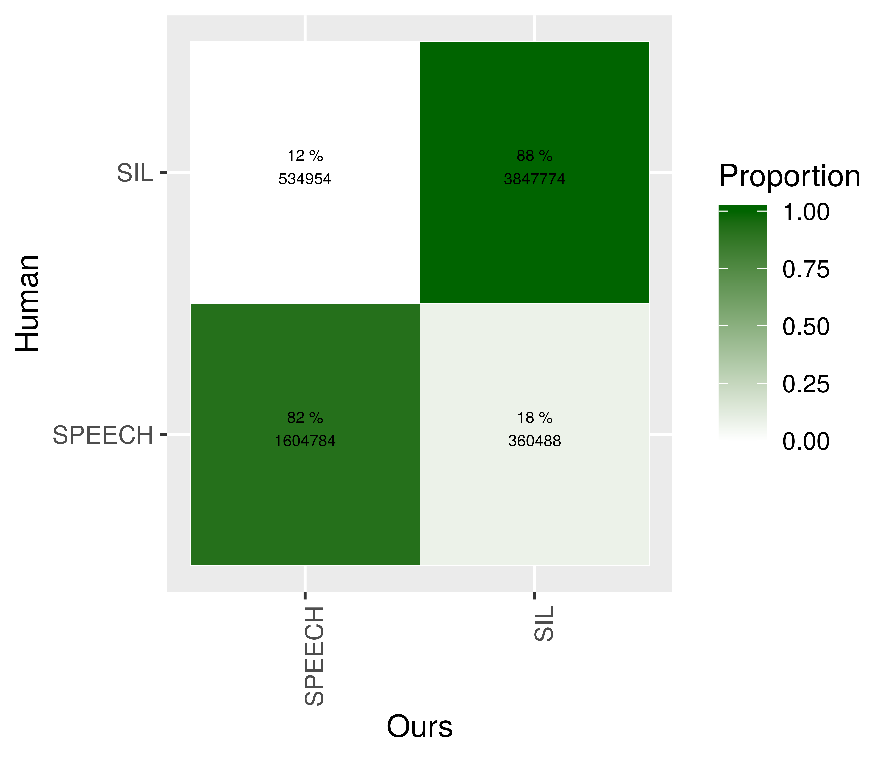

_Observation:_
- Our model is significantly better than LENA to predict speech activity moments.

### Voice types with OVL class

_Choices:_ 
- **OVL** built from the intersection of [**KCHI**, **OCH**, **MAL**, **FEM**] for gold labels and our model.
- **OVL** considered "as is" for LENA labels.
- **ELE** considered "as is" for LENA and gold labels.
- **UNK**, for unknown, correspond to frames that have been classified as belonging only to the **SPEECH** class (and not one of the voice type) by our model. Please note that the gold labels sometimes contains speech that is not classified as belonging to a speaker type and thus this label is also found in the gold annotation.
 

Precision of LENA            |  Recall of LENA
:-------------------------:|:-------------------------:
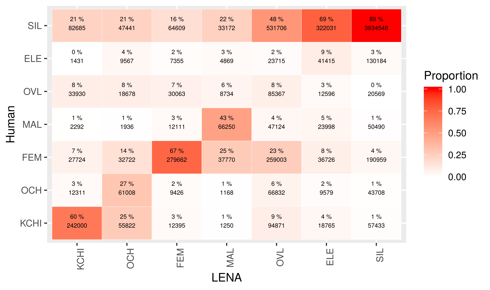 | 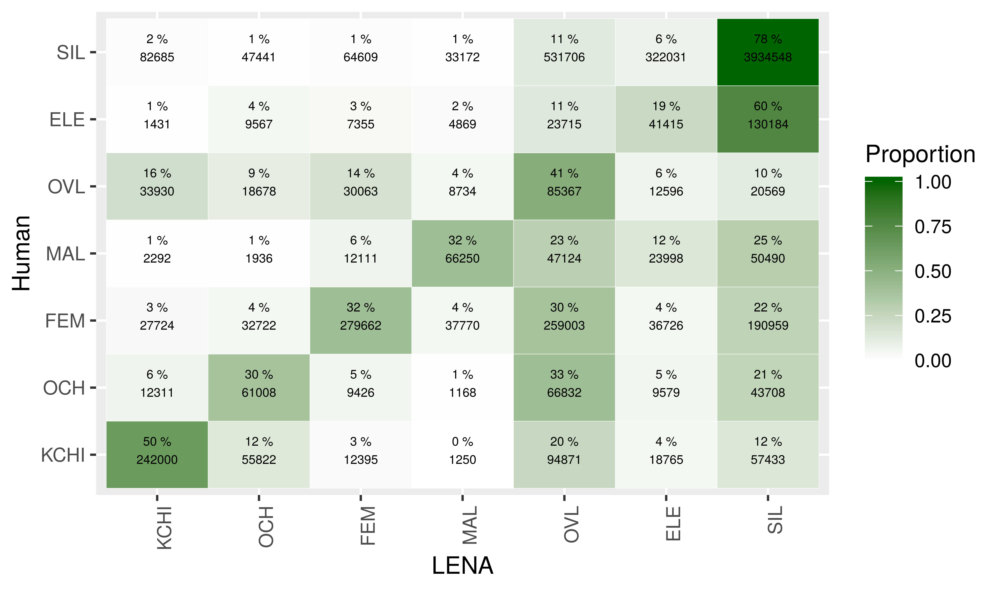 

Precision of our model            |  Recall of our model
:-------------------------:|:-------------------------:
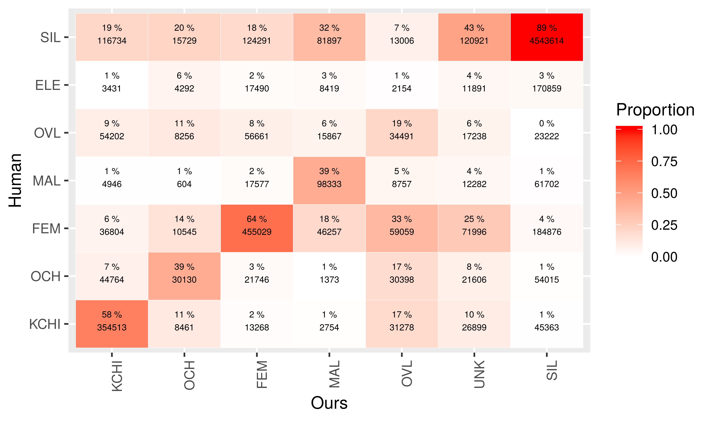 | 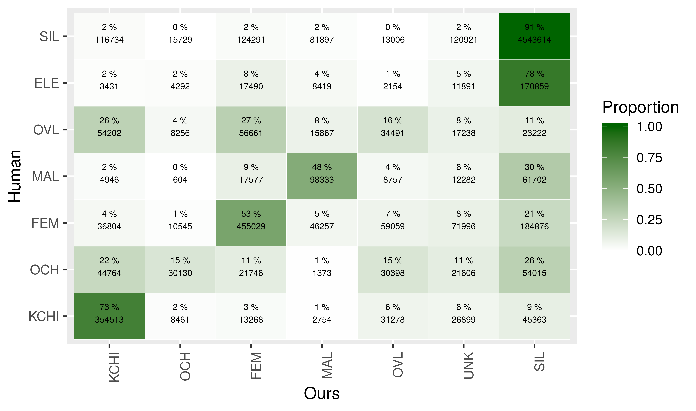 

_Observations:_

By making the choices listed above, we're loosing the information of which type of voices are overlapping when OVL is activated.

- Neither LENA nor our model is useful for predicting *OVL*.
- Our model is better than LENA, in terms of average between precision and recall, for **KCHI**, **MAL** & **FEM**. 
Meaning that our model is better than LENA for these 3 classes in non-overlapping situations.
- We are a bit weaker than LENA for predicting **OCH** when losing moments where the latter is overlapping with another class. 
Meaning that, in the standard set-up, our model is better than LENA on the **OCH** class based on its capacity to predict this class in overlapping situations.

### Voice types spreading overlapping frames to their respective classes

_Choices:_ 
- For our model and the human-made annotations: frames that have been classified as belonging to multiple classes (amongst **KCHI**, **CHI**, **MAL**, **FEM**) are taken into account in all their respective classes.
- **OVL** of LENA mapped to **SIL**.
- **ELE** considered "as is" for LENA and gold labels.
- **UNK**, for unknown, correspond to frames that have been classified as belonging only to the **SPEECH** class (and not one of the voice type) by our model.

Precision of LENA            |  Recall of LENA
:-------------------------:|:-------------------------:
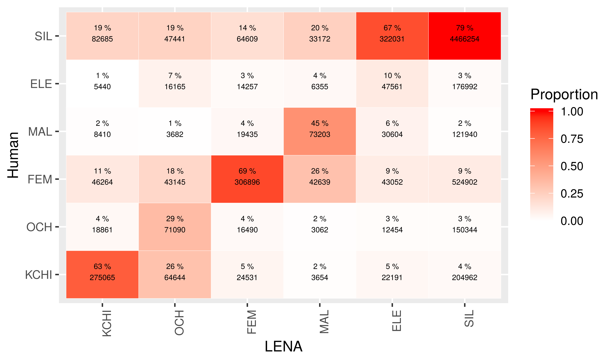 | 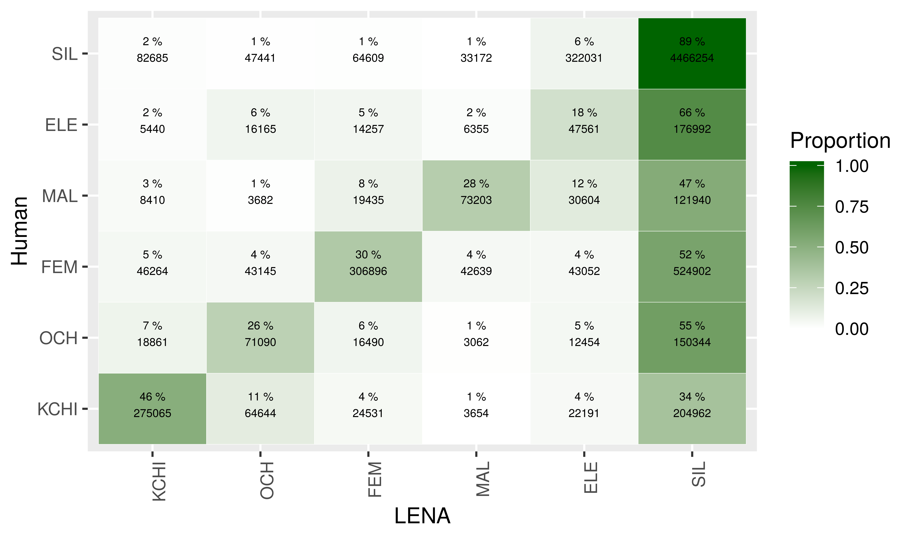 

Precision of our model            |  Recall of our model
:-------------------------:|:-------------------------:
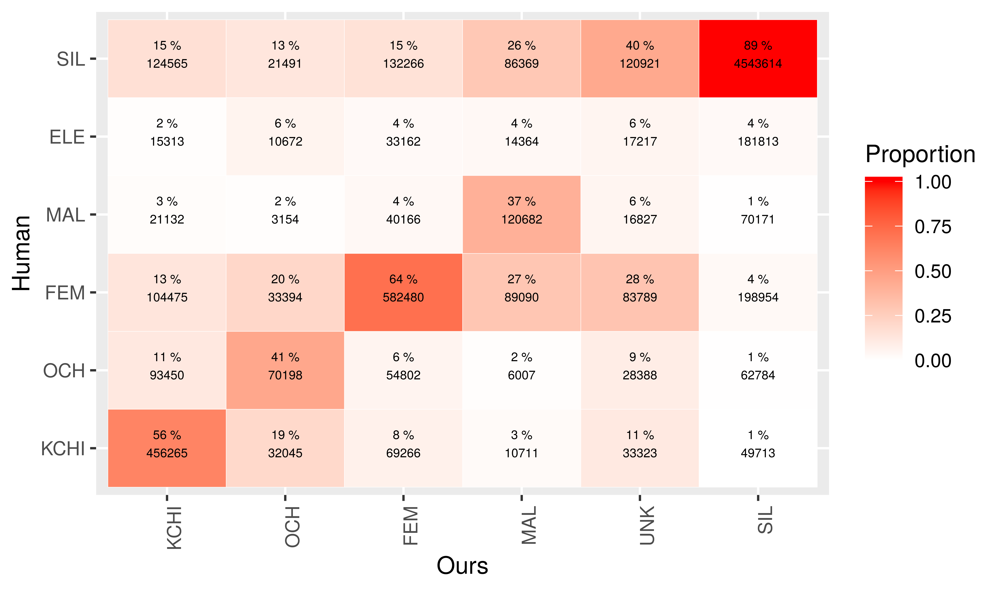 | 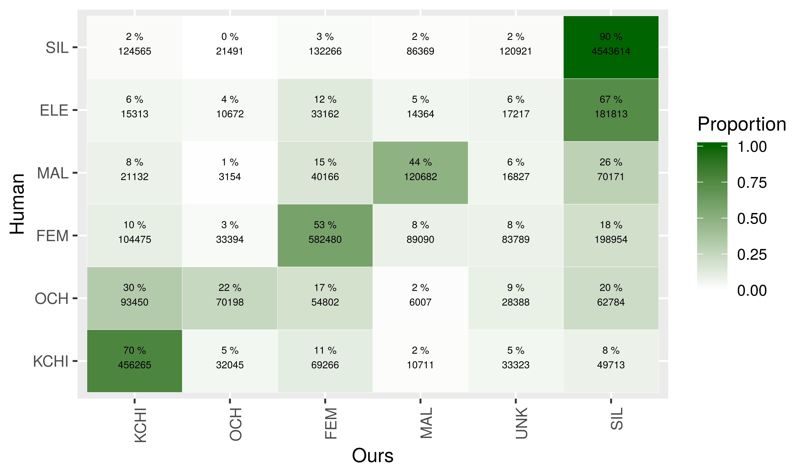 

Observations:

By making the choices listed above, we penalize LENA's design that does not specify which type of classes are overlapping when **OVL** is activated.

- Our model is significantly better than LENA's one in terms of average between precision and recall
- LENA's model has a lower recall for all of the classes (except **OCH**), leading LENA's predictions to wrongly classify speech activity moments as **SIL** (containing also the **OVL** class in this case!)

### Voice types depending on whether they're accompanied of the SPEECH class or not

Concerning the predictions of our model, and to better understand its behavior, we can  look at frames that have been classified as belonging to one of the voice type, depending on whether or not the **SPEECH** class is also activated.

_Choices:_
- **KCHI_nsp** classes correspond to frames that have been classified as belonging to **KCHI** but not belonging to **SPEECH** (same for the other classes).
- **KCHI_sp** classes correspond to frames that have been classified as belonging to both **KCHI** and **SPEECH** by our model (same for the other classes).
- **UNK**, for unknown, correspond to frames that have been classified as belonging only to the **SPEECH** class (and not one of the voice type) by our model.

Precision of our model|
:-------------------------:|
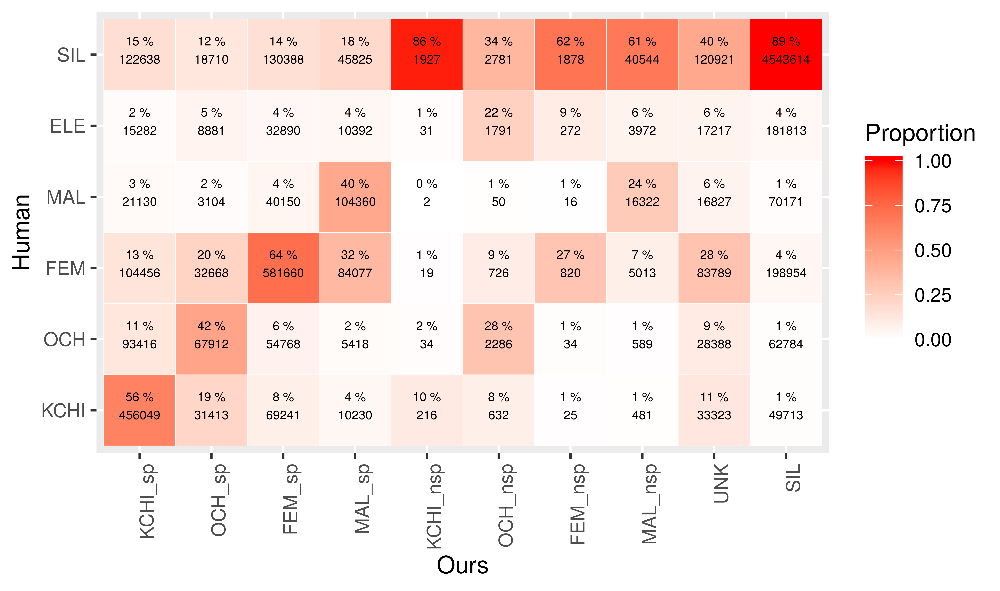 |

 Recall of our model|
:-------------------------:|
 |

_Observations:_

- Relatively high confusion between **KCHI** and **OCH**
- 67% of frames classified as electronic speech by the human are classified as **SIL** by our model
- In most cases, when one of the voice type is activated, **SPEECH** is also activated.

### References

For a complete overview of LENA performances:

1. Cristia, Alejandrina & Lavechin, Marvin & Scaff, Camila & Soderstrom, Melanie & Rowland, Caroline & Räsänen, Okko & Bunce, John & Bergelson, Elika. (2019). A thorough evaluation of the Language Environment Analysis (LENATM) system. 10.31219/osf.io/mxr8s. 